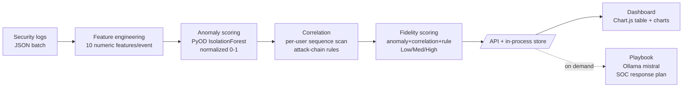
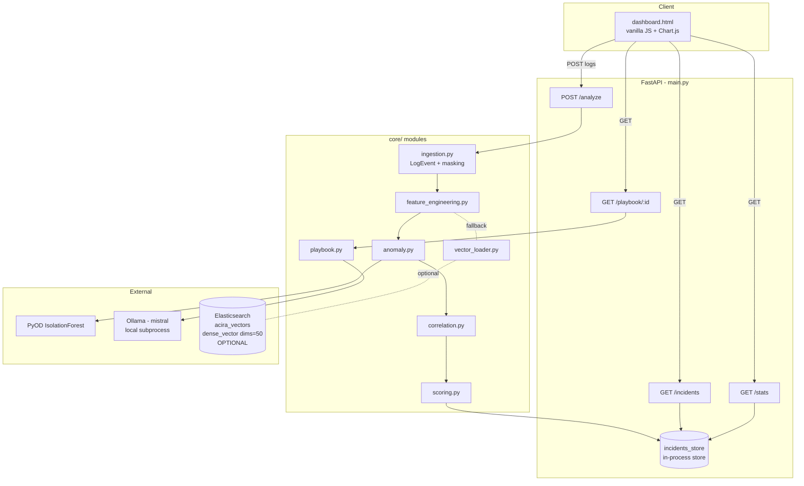

# ACIRA — Autonomous Cyber Incident Response Agent

**A banking-focused SOC (Security Operations Center) incident-response pipeline.** ACIRA ingests structured security logs, scores each event for anomaly with a machine-learning model, stitches related events into multi-step incidents using attack-chain correlation rules, assigns each incident a composite fidelity score and severity, and drafts a SOC response playbook with a local LLM. Results are served over a FastAPI HTTP API and shown on a Chart.js dashboard.

> ACIRA is a **SIEM/UEBA-style incident-response pipeline** (Security Information & Event Management / User & Entity Behavior Analytics) that takes raw security logs and turns them into scored, prioritized, actionable incidents.

---

## Overview

Analysts in a bank's SOC face high log volume. Most events are benign; the dangerous ones are multi-step sequences (a brute-force that ends in privilege escalation, or a password reset immediately followed by a money transfer) that stand out only when you connect the dots across time and per user.

ACIRA is a pipeline that automates that connect-the-dots work end to end:

1. Accept a batch of security-log events (JSON).
2. Turn each event into a numeric feature vector.
3. Score every event for statistical anomaly with an Isolation Forest.
4. Group events per user, sort by time, and detect known attack chains.
5. Score each detected incident (anomaly + correlation + rule severity) into one fidelity number and a Low/Medium/High severity.
6. On demand, ask a local `mistral` model to draft a 4-section SOC response plan.

Each request runs the full pipeline synchronously and returns prioritized incidents.

---

## Key Features

- **Flexible log ingestion** — `POST /analyze` accepts a bare list, a `{"logs": [...]}` wrapper, or a single log object; each item is validated by Pydantic before processing.
- **Isolation Forest anomaly scoring** — PyOD `IForest` scores every event, min-max normalized to `[0.0, 1.0]`.
- **Rule-based incident correlation** — per-user sequence scan detecting two attack chains: brute-force → privilege-escalation, and password-change → transaction. A statistical fallback catches noisy users that match no rule.
- **Composite fidelity scoring** — weighted blend of anomaly score, correlation strength, and rule severity, mapped to Low/Medium/High.
- **LLM playbook generation** — a grounded, format-constrained prompt is sent to a local Ollama `mistral` model to produce a Containment / Eradication / Recovery / Reporting plan.
- **PII masking for the LLM** — `file_path`, `file_hash`, `username`, and `hostname` are masked before the incident is serialized into the prompt. IPs are intentionally preserved so the playbook can give concrete containment guidance.
- **Optional Elasticsearch vector store** — pre-computed 50-dim behavior vectors can be served from an ES index, with automatic fallback to locally computed features when ES is absent, empty, or count-mismatched.
- **Static dashboard** — single-file `dashboard.html` (vanilla JS + Chart.js), no build step.

---

## How It Works



The `/analyze` call runs steps A→E synchronously and holds the resulting incidents in the in-process store for the current analysis session. The dashboard reads them back; playbook generation (H) is a separate on-demand call.

---

## Architecture



---

## Tech Stack

| Layer | Technology | Why |
|-------|-----------|-----|
| API | FastAPI + Uvicorn | Fast to stand up, automatic Pydantic validation, ASGI server bundled |
| Validation | Pydantic v2 | Enforces the log schema at the request boundary |
| Anomaly ML | PyOD `IForest` (Isolation Forest) | Unsupervised, no labels needed, cheap on tabular features |
| Data handling | pandas + numpy | Feature matrix assembly and score normalization |
| LLM | Ollama running `mistral` (local) | Keeps incident data on-box (no cloud call), zero API cost |
| Optional store | Elasticsearch (`dense_vector`, 50 dims) | Serves pre-computed behavior vectors; graceful fallback if absent |
| Frontend | Static HTML + vanilla JS + Chart.js (CDN) | No build tooling; open the file in a browser |

---

## Project Structure

```
acira/
├── main.py                          # FastAPI app + /analyze pipeline orchestration
├── dashboard.html                   # Static dashboard (vanilla JS + Chart.js, hits 127.0.0.1:8000)
├── requirements.txt                 # Pinned dependencies (see Setup for a UTF-8 install tip)
├── core/
│   ├── ingestion.py                 # LogEvent class, mask_value(), JSON + ES log loaders
│   ├── feature_engineering.py       # extract_features() -> (n_events x 10) DataFrame
│   ├── anomaly.py                   # compute_anomaly_scores() via PyOD IForest
│   ├── correlation.py               # detect_incidents() + Incident.calculate_metrics()
│   ├── scoring.py                   # compute_fidelity_score() -> (fidelity, severity)
│   ├── playbook.py                  # generate_playbook() via `ollama run mistral` subprocess
│   ├── vector_loader.py             # fetch_vectors() from ES acira_vectors index
│   ├── vector_upload.py             # bulk-upload pre-computed vectors CSV -> ES
│   ├── vector_store.py              # alternate vector-upload script (dim-validated to 50)
│   ├── es_setup.py                  # create acira_vectors index (dense_vector dims=50)
│   ├── es_reset.py                  # drop + recreate acira_vectors index
│   └── synthetic_log_generator.py   # generate synthetic banking logs with injected attacks
├── data/
│   ├── sample_logs.json             # ~99K synthetic events
│   ├── sample_logs_100.json         # ~119 events (small demo set)
│   └── user_behavior_vectors.csv    # Pre-computed behavior vectors: user_id + pca_0..pca_49
└── docs/
    ├── README.md                    # Long-form design doc
    └── PIPELINE_FLOW.md             # Code-level per-stage walkthrough
```

> `docs/PIPELINE_FLOW.md` is the code-level per-stage reference; `docs/README.md` is the long-form design doc. This root README is the quick-start.

---

## Core Implementation

### Feature engineering (`core/feature_engineering.py`)
Two passes over the batch. Pass 1 aggregates per-user counters (failed logins, password changes). Pass 2 emits a 10-column row per event, always **1:1 aligned with the event list**:

`login_hour`, `odd_hour_flag`, `failed_login_count`, `sensitive_access_flag`, `privilege_escalation_flag`, `suspicious_ip_flag`, `high_threat_intel_flag`, `foreign_geo_flag`, `password_change_flag`, `transaction_flag`.

Notable rules: `odd_hour_flag = 1 if hour < 6 or hour > 22` (i.e. after 10pm or before 6am); `suspicious_ip_flag = 1` if the source IP does not start with `192.`; `foreign_geo_flag = 1` if `geo.country_name != "India"`.

### Anomaly detection (`core/anomaly.py`)
```python
model = IForest(contamination=0.2, random_state=42)
model.fit(feature_df)
scores = model.decision_function(feature_df)
normalized = (scores - min) / (max - min + 1e-8)   # -> [0.0, 1.0]
```
The Isolation Forest is fit on the batch it receives, so anomaly scores are calibrated to the events under analysis. `contamination=0.2` sets the expected anomaly proportion.

### Correlation — attack-chain rules (`core/correlation.py`)
Events are grouped by `user_id`, sorted by timestamp, and accumulated into a growing sequence. After each event, two conditions are checked:

- **Brute-force → privilege escalation:** `has(login_failed) and has(privilege_escalation)`
- **Banking fraud:** `has(password_change) and has(transaction_initiated)`

On the first match, one `Incident` is created from the sequence so far and the scan for that user stops (`break`). If no rule matches but a user has ≥ 5 events with mean anomaly > `0.4`, a **fallback incident** is created from the first 5 events.

`Incident.calculate_metrics()` computes `correlation_strength` from: time-decay (`exp(-duration/3600)`), resource criticality (per-resource weights, e.g. `core_banking_admin_panel`/`swift_gateway` = 1.0, `customer_financial_db` = 0.9, default 0.3), an IP-risk term (internal `192.168.*` low; others hashed into a risk bucket), a threat-intel boost, and a pattern bonus (+0.2 brute-force, +0.25 fraud). The sum is squashed through a logistic sigmoid and clamped to `[0.05, 0.99]`.

### Fidelity scoring (`core/scoring.py`)
```
fidelity = 0.5 * avg_anomaly_score
         + 0.3 * correlation_strength
         + 0.2 * rule_severity
```
`rule_severity` by event mix: password_change + transaction → 0.90; privilege_escalation → 0.85; ≥3 login_failed → 0.60; transaction_initiated only → 0.40; else 0.20. Severity bands: `> 0.85` High, `> 0.50` Medium, else Low.

### LLM playbook (`core/playbook.py`)
The incident is serialized (with PII masked via `mask_value()`), embedded into a grounded, format-constrained prompt ("Base response ONLY on provided data. Do NOT hallucinate…"), and passed to:
```python
subprocess.run(["ollama", "run", "mistral"], input=prompt, capture_output=True, text=True, ...)
```
The playbook runs entirely on the local Ollama install, so incident data never leaves the box and there is no cloud API cost.

### Optional ES vector store with fallback (`core/vector_loader.py`, `main.py`)
`/analyze` tries `fetch_vectors()` from the `acira_vectors` ES index. It uses ES vectors when their **count exactly matches** the event count; otherwise (mismatch, empty index, or exception) it falls back to the locally computed `feature_df`. Elasticsearch is entirely optional to run the pipeline.

### Precomputed behavior features
Behavior feature vectors are precomputed and shipped as data in `data/user_behavior_vectors.csv` (columns `user_id`, `pca_0` … `pca_49`). They are loaded into ES by `vector_upload.py` / `vector_store.py` and served from the `acira_vectors` index when Elasticsearch is enabled.

---

## AI / ML Components

- **Isolation Forest (PyOD `IForest`)** — `contamination=0.2`, `random_state=42`, all other params default. Fit on the incoming batch; scores min-max normalized to `[0, 1]` and calibrated to the events under analysis.
- **Ollama `mistral`** — local LLM invoked as a subprocess for playbook prose. Grounded, format-constrained prompt; keeps incident data on-box.
- **Elasticsearch `dense_vector` (dims = 50)** — the `acira_vectors` index stores 50-dim pre-computed behavior vectors. Optional; used when its row count matches the incoming event count.

---

## API Endpoints

Base URL: `http://127.0.0.1:8000` (the dashboard is configured to this).

| Method | Path | Purpose |
|--------|------|---------|
| `GET`  | `/` | Service banner + feature list. |
| `POST` | `/analyze` | Run the full pipeline on a batch of logs; returns incident summaries and holds them in the analysis store. Accepts a list, a `{"logs": [...]}` wrapper, or a single object. |
| `GET`  | `/incidents` | Return incidents from the most recent `/analyze` run. |
| `GET`  | `/playbook/{incident_id}` | Generate (via Ollama `mistral`) and return a SOC response plan for one stored incident. |
| `GET`  | `/stats` | Aggregate stats over stored incidents: total count, severity breakdown, average fidelity, average correlation. |

Interactive docs are available at `http://127.0.0.1:8000/docs` (FastAPI/Swagger).

---

## Data Model & Storage

**Log input** (`LogInput` / `LogEvent`) — required: `user_id`, `source_ip_address`, `destination_ip_address`, `event_type`, `timestamp` (ISO 8601), `resource_accessed`. Optional: `dns_query`, `file_path`, `file_hash`, `username`, `hostname`, `geo` (`{country_name: ...}`), `threat_intel_score`.

**Incident storage** — incidents are held in an in-process store for the current analysis session:
```python
incidents_store = []   # main.py — holds the incidents from the latest /analyze run
```
`/incidents`, `/playbook/{id}`, and `/stats` read from the most recent run.

**Elasticsearch index** — optional, only for pre-computed vectors:
```
index: acira_vectors
  user_id:   keyword
  timestamp: date
  features:  dense_vector (dims = 50)
```
(`ingestion.py` also defines an `acira_logs` index for raw-log I/O; the live `/analyze` pipeline receives logs over HTTP.)

---

## Setup & Installation

### Prerequisites
- Python 3.11+
- [Ollama](https://ollama.com/) with the `mistral` model pulled — **required** for `/playbook/{id}` (the rest of the pipeline works without it)
- Elasticsearch 8.x/9.x on `http://localhost:9200` — **optional** (pipeline falls back to local features if absent)

### 1. Clone and create a virtualenv
```bash
git clone <repo-url> acira
cd acira
python -m venv .venv
# Windows:
.venv\Scripts\activate
# Linux/macOS:
source .venv/bin/activate
```

### 2. Install dependencies
Save `requirements.txt` as UTF-8 before installing, then run `pip`:
```powershell
# PowerShell (Windows)
Get-Content requirements.txt | Set-Content -Encoding utf8 requirements.utf8.txt
pip install -r requirements.utf8.txt
```
```bash
# Linux/macOS
iconv -f UTF-16LE -t UTF-8 requirements.txt > requirements.utf8.txt
pip install -r requirements.utf8.txt
```

### 3. Pull the LLM (needed for playbooks)
```bash
ollama pull mistral
```

### 4. (Optional) Set up Elasticsearch + load pre-computed vectors
```bash
python -m core.es_setup                 # create acira_vectors index (dims=50)
python -m core.vector_upload            # load data/user_behavior_vectors.csv into ES
```
Skip this entirely to run with the built-in local-feature fallback.

### 5. (Optional) Regenerate synthetic logs
```bash
python -m core.synthetic_log_generator  # writes data/sample_logs_100.json
```

All `core/*` modules run as modules from the repo root: `python -m core.<name>`.

---

## Configuration

Defaults are set in source and ready to run out of the box:
- Elasticsearch URL: `http://localhost:9200` (in `ingestion.py`, `vector_loader.py`, `vector_store.py`, `es_setup.py`, `es_reset.py`)
- API host/port: `0.0.0.0:8000` (in `main.py`)
- Dashboard API base: `http://127.0.0.1:8000` (in `dashboard.html`)
- LLM: `ollama run mistral` (in `playbook.py`)

---

## Running

Start the API:
```bash
python main.py
# or:
uvicorn main:app --host 0.0.0.0 --port 8000
```

Open the dashboard: open `dashboard.html` in a browser (no server needed for the static file). It calls the API at `http://127.0.0.1:8000`. Upload a JSON log file (e.g. `data/sample_logs_100.json`) to run the pipeline, then click a row to generate its playbook.

Run any stage standalone (each module has a `__main__` self-test that reads `data/sample_logs.json`; several stages also read from ES when populated):
```bash
python -m core.feature_engineering
python -m core.anomaly
python -m core.scoring
python -m core.playbook
```
